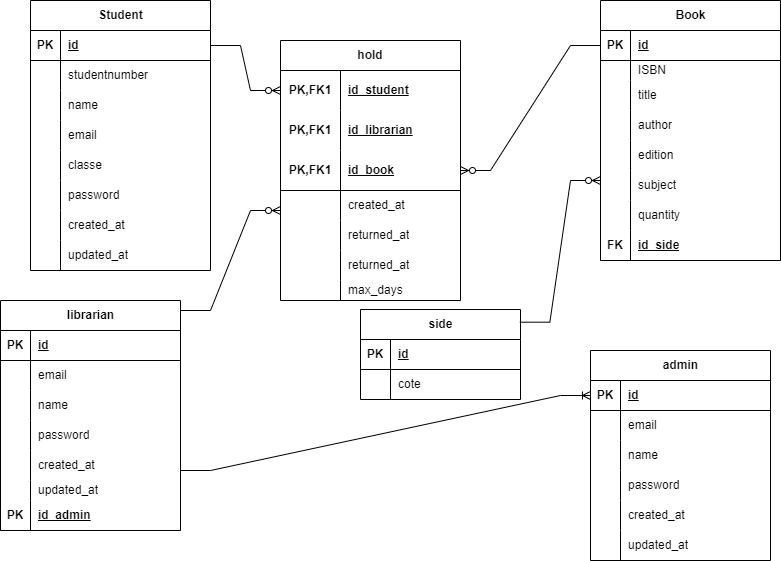
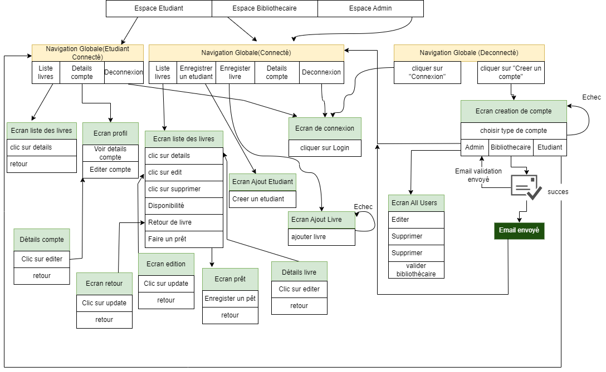

# README

This README would normally document whatever steps are necessary to get the
application up and running.

Things you may want to cover:


# Langages de développement.
- ruby on rails (6.0.6)
- Ruby (3.0.1)

# Execution Procedure
```
git clone git@github.com:username/TrackIt.git
bundle install
rails webpacker:install
rails db:create
rails db:migrate
rails s
```

# Check Sheet, Catalog Design and Table Definition Document


[All links](https://docs.google.com/spreadsheets/d/12vEffGu4whkfAvLp_q4JTCN1aRN_vWnuIqY7qf7uIEM/edit?usp=sharing)

## Wireframe


[Wireframe](https://www.figma.com/file/H7PvII5EKmNbFfsS2zveAE/Untitled?type=design&node-id=0%3A1&mode=design&t=Qzfcvez586rZ4Q1i-1)


# ERD


# SCREEN TRANSITION DIAGRAM

